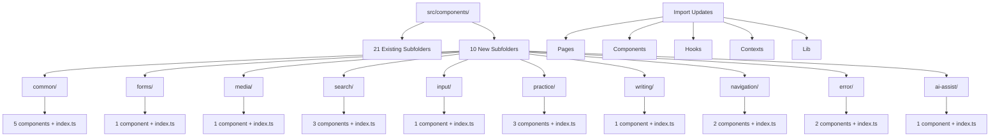

# Design Document — Phase 1: Reorganize Components

## Overview

This design document outlines the technical approach for reorganizing the `src/components/` directory structure. Currently, 21 component files exist at the root level of `src/components/`, making navigation and maintenance difficult. This refactoring will group these components into 10 functional subfolders while preserving git history and ensuring zero breaking changes.

**Goals:**
- Improve component discoverability through logical grouping
- Maintain git history for all moved files
- Ensure zero breaking changes (all imports updated automatically)
- Create index files for convenient imports
- Validate success through build verification

**Non-Goals:**
- Refactoring component internal logic
- Changing component APIs or props
- Modifying existing 21 subfolders
- Performance optimization
- Adding new tests

---

## Architecture

### Current Structure

```
src/components/
├── AI/
├── analytics/
├── auth/
... (21 existing subfolders)
├── ConfettiProvider.tsx          ← 21 loose files
├── CreatePassageDialog.tsx
├── DailyPractice.tsx
... (18 more loose files)
```

### Target Structure

```
src/components/
├── AI/
├── analytics/
... (21 existing subfolders unchanged)
├── common/                        ← NEW
│   ├── ConfettiProvider.tsx
│   ├── JapaneseText.tsx
│   ├── Leaderboard.tsx
│   ├── StreakBadge.tsx
│   ├── StreakReminderBanner.tsx
│   └── index.ts
├── forms/                         ← NEW
│   ├── CreatePassageDialog.tsx
│   └── index.ts
├── media/                         ← NEW
│   ├── DictationPlayer.tsx
│   └── index.ts
├── search/                        ← NEW
│   ├── JishoSearch.tsx
│   ├── KanjiSuggestions.tsx
│   ├── WordLookupPanel.tsx
│   └── index.ts
├── input/                         ← NEW
│   ├── KanaKeyboard.tsx
│   └── index.ts
├── practice/                      ← NEW
│   ├── DailyPractice.tsx
│   ├── PronunciationAnalysis.tsx
│   ├── SpeakingPracticeMode.tsx
│   └── index.ts
├── writing/                       ← NEW
│   ├── KanjiStrokeOrder.tsx
│   └── index.ts
├── navigation/                    ← NEW
│   ├── Navigation.tsx
│   ├── NavLink.tsx
│   └── index.ts
├── error/                         ← NEW
│   ├── SectionErrorBoundary.tsx
│   ├── StandardErrorBoundary.tsx
│   └── index.ts
├── ai-assist/                     ← NEW
│   ├── UnitAIAssistant.tsx
│   └── index.ts
└── pwa/                           ← EXISTING (add InstallPrompt.tsx)
    ├── InstallPrompt.tsx          ← MOVED HERE
    └── index.ts                   ← UPDATE
```

### Architecture Diagram



---

## Components and Interfaces

### Component Grouping Strategy

**Grouping Principles:**
1. **Functional cohesion**: Components with similar purposes grouped together
2. **Reusability**: Common components separated from specialized ones
3. **Domain alignment**: Components grouped by feature domain (search, practice, etc.)
4. **Size balance**: Avoid creating folders with too many or too few components

### Component Mapping

| Subfolder | Components | Count | Rationale |
|-----------|-----------|-------|-----------|
| `common/` | ConfettiProvider, JapaneseText, Leaderboard, StreakBadge, StreakReminderBanner | 5 | Widely reused across app |
| `forms/` | CreatePassageDialog | 1 | Dialog/form components |
| `media/` | DictationPlayer | 1 | Audio/video players |
| `search/` | JishoSearch, KanjiSuggestions, WordLookupPanel | 3 | Search and lookup functionality |
| `input/` | KanaKeyboard | 1 | Input method components |
| `practice/` | DailyPractice, PronunciationAnalysis, SpeakingPracticeMode | 3 | Learning practice modes |
| `writing/` | KanjiStrokeOrder | 1 | Writing/stroke components |
| `navigation/` | Navigation, NavLink | 2 | Navigation UI |
| `error/` | SectionErrorBoundary, StandardErrorBoundary | 2 | Error handling |
| `ai-assist/` | UnitAIAssistant | 1 | AI assistant features |
| `pwa/` (existing) | InstallPrompt | 1 | PWA-related components |

### Index File Interface

Each subfolder will have an `index.ts` that re-exports all components:

```typescript
// Example: src/components/common/index.ts
export { ConfettiProvider } from './ConfettiProvider';
export { JapaneseText } from './JapaneseText';
export { Leaderboard } from './Leaderboard';
export { StreakBadge } from './StreakBadge';
export { StreakReminderBanner } from './StreakReminderBanner';
```

**Index File Requirements:**
- Use named exports (not `export * from`)
- Preserve original export names
- One export statement per component
- Alphabetical ordering for consistency

---

## Data Models

### File Move Operation

```typescript
interface FileMoveOperation {
  sourceFile: string;           // e.g., "src/components/Navigation.tsx"
  targetFolder: string;          // e.g., "src/components/navigation/"
  targetFile: string;            // e.g., "src/components/navigation/Navigation.tsx"
  gitCommand: string;            // "git mv <source> <target>"
}
```

### Import Update Operation

```typescript
interface ImportUpdateOperation {
  filePath: string;              // File containing the import
  lineNumber: number;            // Line number of import
  oldImport: string;             // e.g., "@/components/Navigation"
  newImport: string;             // e.g., "@/components/navigation/Navigation"
  importType: 'absolute' | 'relative';
}
```

### Refactoring State

```typescript
interface RefactoringState {
  phase: 'create-folders' | 'move-files' | 'update-imports' | 'create-indexes' | 'validate';
  completedGroups: string[];     // ['common', 'forms', ...]
  pendingGroups: string[];
  errors: RefactoringError[];
  importUpdates: ImportUpdateOperation[];
}
```

---

## Migration Strategy

### Phase-by-Phase Execution

The refactoring will be executed in sequential phases to minimize risk:

**Phase 1: Create Folder Structure**
```bash
mkdir -p src/components/{common,forms,media,search,input,practice,writing,navigation,error,ai-assist}
```

**Phase 2: Move Files by Group**

Execute moves group-by-group, validating after each:

1. **Group: common** (5 files)
   ```bash
   git mv src/components/ConfettiProvider.tsx src/components/common/
   git mv src/components/JapaneseText.tsx src/components/common/
   git mv src/components/Leaderboard.tsx src/components/common/
   git mv src/components/StreakBadge.tsx src/components/common/
   git mv src/components/StreakReminderBanner.tsx src/components/common/
   ```

2. **Group: forms** (1 file)
   ```bash
   git mv src/components/CreatePassageDialog.tsx src/components/forms/
   ```

3. **Group: media** (1 file)
   ```bash
   git mv src/components/DictationPlayer.tsx src/components/media/
   ```

4. **Group: search** (3 files)
   ```bash
   git mv src/components/JishoSearch.tsx src/components/search/
   git mv src/components/KanjiSuggestions.tsx src/components/search/
   git mv src/components/WordLookupPanel.tsx src/components/search/
   ```

5. **Group: input** (1 file)
   ```bash
   git mv src/components/KanaKeyboard.tsx src/components/input/
   ```

6. **Group: practice** (3 files)
   ```bash
   git mv src/components/DailyPractice.tsx src/components/practice/
   git mv src/components/PronunciationAnalysis.tsx src/components/practice/
   git mv src/components/SpeakingPracticeMode.tsx src/components/practice/
   ```

7. **Group: writing** (1 file)
   ```bash
   git mv src/components/KanjiStrokeOrder.tsx src/components/writing/
   ```

8. **Group: navigation** (2 files)
   ```bash
   git mv src/components/Navigation.tsx src/components/navigation/
   git mv src/components/NavLink.tsx src/components/navigation/
   ```

9. **Group: error** (2 files)
   ```bash
   git mv src/components/SectionErrorBoundary.tsx src/components/error/
   git mv src/components/StandardErrorBoundary.tsx src/components/error/
   ```

10. **Group: ai-assist** (1 file)
    ```bash
    git mv src/components/UnitAIAssistant.tsx src/components/ai-assist/
    ```

11. **Group: pwa** (1 file - to existing folder)
    ```bash
    git mv src/components/InstallPrompt.tsx src/components/pwa/
    ```

**Phase 3: Update Imports**

After each group move, update all imports:

```bash
# Find all files importing the moved component
rg -l "from ['\"]@/components/ComponentName['\"]" src/

# Update imports programmatically
# Example: Navigation.tsx moved to navigation/
# Old: import { Navigation } from '@/components/Navigation'
# New: import { Navigation } from '@/components/navigation/Navigation'
```

**Phase 4: Create Index Files**

Create `index.ts` for each new subfolder with proper exports.

**Phase 5: Validate**

```bash
# TypeScript check
npx tsc --noEmit

# Build check
npm run build

# Verify no old imports remain
rg "from ['\"]@/components/(ConfettiProvider|CreatePassageDialog|...)['\"]" src/
```

### Rollback Strategy

If validation fails at any phase:
1. Use `git reset --hard` to revert to pre-refactoring state
2. Analyze failure cause
3. Fix issue in design/implementation
4. Retry from Phase 1

---

## Import Update Strategy

### Import Pattern Detection

**Absolute Imports (using path alias):**
```typescript
// Pattern: @/components/ComponentName
import { Navigation } from '@/components/Navigation';
import Navigation from '@/components/Navigation';
```

**Relative Imports:**
```typescript
// Pattern: ../components/ComponentName or ./ComponentName
import { Navigation } from '../Navigation';
import { Navigation } from '../../components/Navigation';
```

### Import Update Algorithm

```typescript
function updateImports(movedComponent: string, targetFolder: string) {
  // 1. Find all files with imports
  const files = findFilesWithImport(movedComponent);
  
  // 2. For each file, update import path
  for (const file of files) {
    const content = readFile(file);
    const updatedContent = content.replace(
      // Old pattern: @/components/ComponentName
      new RegExp(`@/components/${movedComponent}`, 'g'),
      // New pattern: @/components/subfolder/ComponentName
      `@/components/${targetFolder}/${movedComponent}`
    );
    writeFile(file, updatedContent);
  }
}
```

### Files to Scan

Import updates must cover all TypeScript/JavaScript files:
- `src/pages/**/*.{ts,tsx}`
- `src/components/**/*.{ts,tsx}`
- `src/hooks/**/*.{ts,tsx}`
- `src/contexts/**/*.{ts,tsx}`
- `src/lib/**/*.{ts,tsx}`
- `src/integrations/**/*.{ts,tsx}`
- `src/types/**/*.{ts,tsx}`
- `src/*.{ts,tsx}` (root level files like App.tsx)

### Import Update Verification

After updates, verify:
1. No imports point to old paths (grep check)
2. TypeScript compilation succeeds
3. Build succeeds
4. No runtime import errors

---

## Correctness Properties

*A property is a characteristic or behavior that should hold true across all valid executions of a system—essentially, a formal statement about what the system should do. Properties serve as the bridge between human-readable specifications and machine-verifiable correctness guarantees.*

### Property 1: Existing Folders Invariant

*For any* subfolder that existed before refactoring (the 21 existing subfolders: AI/, analytics/, auth/, chat/, dashboard/, dictionary/, duel/, effects/, flashcards/, games/, grammar/, kanji/, layout/, lexicon/, pet/, pwa/, review/, skills/, ui/, video/, vocabulary/), that subfolder should still exist after refactoring with its contents unchanged.

**Validates: Requirements 1.2**

### Property 2: Git History Preservation

*For any* component file that is moved, running `git log --follow <new-path>` should show the complete commit history from before the move, proving that git history was preserved through the use of `git mv`.

**Validates: Requirements 2.6, 3.2, 4.2, 5.4, 6.2, 7.4, 8.2, 9.3, 10.3, 11.2, 12.2**

### Property 3: Import Path Update Completeness

*For any* moved component, all import statements in the codebase (in files with extensions .ts, .tsx, .js, .jsx) should reference the new path, and no import statements should reference the old path.

**Validates: Requirements 13.1, 13.2, 13.3, 13.4, 15.4**

### Property 4: Build Success After Import Updates

*For any* valid codebase state before refactoring where `npm run build` succeeds, after moving components and updating all imports, `npm run build` should still succeed without import errors.

**Validates: Requirements 13.5**

### Property 5: Index File Completeness

*For any* component in a new subfolder, that component should be re-exported in the subfolder's `index.ts` file using a named export with the same export name as the original component.

**Validates: Requirements 14.1, 14.2, 14.3, 14.4**

### Property 6: Component Content Invariant

*For any* component file that is moved, the file content (excluding the file path) should be byte-for-byte identical before and after the move—no changes to internal logic, exports, or code.

**Validates: Requirements 16.1, 16.2, 16.3**

### Property 7: Idempotence of Refactoring

*For any* codebase state, running the complete refactoring operation twice should produce the same final directory structure and file contents as running it once—no duplicate folders, no duplicate moves, no corrupted state.

**Validates: Requirements 15.5**

### Property 8: No Loose Files at Root

*For any* file (not directory) at `src/components/` root level after refactoring completes, the count should be zero—all component files should be organized into subfolders.

**Validates: Requirements 1.3**

---

## Error Handling

### Error Categories

**1. File System Errors**
- **Cause**: Permission issues, disk space, file locks
- **Detection**: OS error codes from file operations
- **Handling**: Abort operation, display error message, preserve original state
- **Recovery**: Manual intervention required

**2. Git Operation Errors**
- **Cause**: Uncommitted changes, merge conflicts, detached HEAD
- **Detection**: Non-zero exit code from `git mv`
- **Handling**: Abort operation, display git error message
- **Recovery**: User must resolve git state before retrying

**3. Import Update Errors**
- **Cause**: Malformed import syntax, dynamic imports, non-standard patterns
- **Detection**: Regex match failures, TypeScript compilation errors
- **Handling**: Log problematic imports, continue with others, report at end
- **Recovery**: Manual review and fix of reported imports

**4. Build Validation Errors**
- **Cause**: Breaking changes, missing dependencies, type errors
- **Detection**: Non-zero exit code from `npm run build` or `tsc`
- **Handling**: Display build errors, rollback changes
- **Recovery**: Analyze build errors, fix issues, retry refactoring

**5. Idempotence Violations**
- **Cause**: Running refactoring on already-refactored codebase
- **Detection**: Target folders already exist, source files not found
- **Handling**: Skip already-completed operations, warn user
- **Recovery**: No action needed if state is correct

### Error Handling Strategy

```typescript
interface RefactoringError {
  phase: string;
  operation: string;
  error: Error;
  context: Record<string, any>;
}

class RefactoringExecutor {
  private errors: RefactoringError[] = [];
  
  async execute() {
    try {
      await this.createFolders();
      await this.moveFilesByGroup();
      await this.updateImports();
      await this.createIndexFiles();
      await this.validate();
    } catch (error) {
      this.handleError(error);
      await this.rollback();
      throw error;
    }
  }
  
  private handleError(error: Error) {
    this.errors.push({
      phase: this.currentPhase,
      operation: this.currentOperation,
      error,
      context: this.getContext()
    });
    console.error('Refactoring failed:', error);
  }
  
  private async rollback() {
    console.log('Rolling back changes...');
    execSync('git reset --hard HEAD');
    console.log('Rollback complete. Repository restored to pre-refactoring state.');
  }
}
```

### Validation Checks

**Pre-flight Checks (before starting):**
- Git working directory is clean (no uncommitted changes)
- All 21 loose files exist at expected locations
- Node modules installed
- TypeScript and build tools available

**Post-move Checks (after each group):**
- Files exist at new locations
- Files removed from old locations
- Git history preserved (git log shows history)

**Post-import-update Checks:**
- No imports reference old paths
- TypeScript compilation succeeds
- No syntax errors introduced

**Final Validation:**
- Build succeeds (`npm run build`)
- No loose files at `src/components/` root
- All index files created
- All imports updated

---

## Testing Strategy

### Dual Testing Approach

This refactoring will be validated through both **unit tests** (for specific examples and edge cases) and **property-based tests** (for universal properties across all components).

**Unit Tests** focus on:
- Specific file moves (e.g., Navigation.tsx moved to navigation/)
- Specific import updates (e.g., App.tsx import updated correctly)
- Edge cases (e.g., handling files with multiple imports)
- Error conditions (e.g., missing source file)

**Property-Based Tests** focus on:
- Universal properties that hold for all 21 moved files
- Comprehensive input coverage through randomization
- Invariants that must be preserved (git history, file content, existing folders)

### Property-Based Testing Configuration

**Library**: Use `fast-check` for TypeScript property-based testing

**Configuration**:
- Minimum 100 iterations per property test
- Each test tagged with reference to design document property

**Test Structure**:
```typescript
import fc from 'fast-check';

describe('Component Refactoring Properties', () => {
  
  it('Property 1: Existing Folders Invariant', () => {
    // Feature: refactor-phase-1-components, Property 1: For any subfolder that existed before refactoring, that subfolder should still exist after refactoring with its contents unchanged
    
    fc.assert(
      fc.property(
        fc.constantFrom(...EXISTING_FOLDERS),
        (folder) => {
          const beforeContents = listDirectory(`src/components/${folder}`);
          // ... perform refactoring ...
          const afterContents = listDirectory(`src/components/${folder}`);
          expect(afterContents).toEqual(beforeContents);
        }
      ),
      { numRuns: 100 }
    );
  });
  
  it('Property 2: Git History Preservation', () => {
    // Feature: refactor-phase-1-components, Property 2: For any component file that is moved, git history should be preserved
    
    fc.assert(
      fc.property(
        fc.constantFrom(...MOVED_COMPONENTS),
        (component) => {
          const oldPath = `src/components/${component.file}`;
          const newPath = `src/components/${component.folder}/${component.file}`;
          
          const historyBefore = execSync(`git log --oneline ${oldPath}`).toString();
          // ... perform git mv ...
          const historyAfter = execSync(`git log --follow --oneline ${newPath}`).toString();
          
          expect(historyAfter).toContain(historyBefore.split('\n')[0]); // First commit should be in history
        }
      ),
      { numRuns: 100 }
    );
  });
  
  it('Property 3: Import Path Update Completeness', () => {
    // Feature: refactor-phase-1-components, Property 3: For any moved component, all imports should reference new path
    
    fc.assert(
      fc.property(
        fc.constantFrom(...MOVED_COMPONENTS),
        (component) => {
          // ... perform refactoring ...
          
          const oldImportPattern = `@/components/${component.name}`;
          const filesWithOldImport = execSync(
            `rg -l "from ['\"]${oldImportPattern}['\"]" src/`
          ).toString();
          
          expect(filesWithOldImport).toBe(''); // No files should have old import
        }
      ),
      { numRuns: 100 }
    );
  });
  
  it('Property 6: Component Content Invariant', () => {
    // Feature: refactor-phase-1-components, Property 6: For any moved component, file content should be identical
    
    fc.assert(
      fc.property(
        fc.constantFrom(...MOVED_COMPONENTS),
        (component) => {
          const oldPath = `src/components/${component.file}`;
          const newPath = `src/components/${component.folder}/${component.file}`;
          
          const contentBefore = fs.readFileSync(oldPath, 'utf-8');
          // ... perform git mv ...
          const contentAfter = fs.readFileSync(newPath, 'utf-8');
          
          expect(contentAfter).toBe(contentBefore);
        }
      ),
      { numRuns: 100 }
    );
  });
  
  it('Property 7: Idempotence of Refactoring', () => {
    // Feature: refactor-phase-1-components, Property 7: Running refactoring twice produces same result as once
    
    const initialState = captureDirectoryState('src/components');
    
    performRefactoring();
    const stateAfterFirst = captureDirectoryState('src/components');
    
    performRefactoring();
    const stateAfterSecond = captureDirectoryState('src/components');
    
    expect(stateAfterSecond).toEqual(stateAfterFirst);
  });
  
});
```

### Unit Test Examples

```typescript
describe('Component Refactoring Unit Tests', () => {
  
  it('should move Navigation.tsx to navigation/ folder', () => {
    expect(fs.existsSync('src/components/navigation/Navigation.tsx')).toBe(true);
    expect(fs.existsSync('src/components/Navigation.tsx')).toBe(false);
  });
  
  it('should update Navigation import in App.tsx', () => {
    const appContent = fs.readFileSync('src/App.tsx', 'utf-8');
    expect(appContent).toContain("from '@/components/navigation/Navigation'");
    expect(appContent).not.toContain("from '@/components/Navigation'");
  });
  
  it('should create index.ts in common/ folder', () => {
    expect(fs.existsSync('src/components/common/index.ts')).toBe(true);
  });
  
  it('should re-export all components in common/index.ts', () => {
    const indexContent = fs.readFileSync('src/components/common/index.ts', 'utf-8');
    expect(indexContent).toContain("export { ConfettiProvider } from './ConfettiProvider'");
    expect(indexContent).toContain("export { JapaneseText } from './JapaneseText'");
    expect(indexContent).toContain("export { Leaderboard } from './Leaderboard'");
    expect(indexContent).toContain("export { StreakBadge } from './StreakBadge'");
    expect(indexContent).toContain("export { StreakReminderBanner } from './StreakReminderBanner'");
  });
  
  it('should handle edge case: component imported multiple times in same file', () => {
    // Create test file with multiple imports
    const testFile = 'src/test-multiple-imports.tsx';
    fs.writeFileSync(testFile, `
      import { Navigation } from '@/components/Navigation';
      import { Navigation as Nav } from '@/components/Navigation';
    `);
    
    performRefactoring();
    
    const content = fs.readFileSync(testFile, 'utf-8');
    expect(content).toContain("from '@/components/navigation/Navigation'");
    expect(content).not.toContain("from '@/components/Navigation'");
    
    fs.unlinkSync(testFile);
  });
  
  it('should build successfully after refactoring', () => {
    const result = execSync('npm run build', { encoding: 'utf-8' });
    expect(result).not.toContain('error');
  });
  
});
```

### Manual Testing Checklist

After automated tests pass, perform manual verification:

- [ ] Navigate to each new subfolder in file explorer
- [ ] Verify all expected files present
- [ ] Open random component files, verify content unchanged
- [ ] Run `git log --follow` on 3-5 moved files, verify history intact
- [ ] Search codebase for old import patterns (should find none)
- [ ] Run dev server (`npm run dev`), verify app loads
- [ ] Navigate through app UI, verify no runtime errors
- [ ] Check browser console for import errors
- [ ] Test 2-3 features that use moved components

### Validation Commands

```bash
# Check no loose files at root
ls src/components/*.tsx 2>/dev/null | wc -l  # Should output: 0

# Check all new folders exist
for folder in common forms media search input practice writing navigation error ai-assist; do
  [ -d "src/components/$folder" ] && echo "$folder: ✓" || echo "$folder: ✗"
done

# Check no old imports remain
rg "from ['\"]@/components/(ConfettiProvider|CreatePassageDialog|DailyPractice|DictationPlayer|InstallPrompt|JapaneseText|JishoSearch|KanaKeyboard|KanjiStrokeOrder|KanjiSuggestions|Leaderboard|Navigation|NavLink|PronunciationAnalysis|SectionErrorBoundary|SpeakingPracticeMode|StandardErrorBoundary|StreakBadge|StreakReminderBanner|UnitAIAssistant|WordLookupPanel)['\"]" src/

# TypeScript check
npx tsc --noEmit

# Build check
npm run build

# Git history check (example)
git log --follow --oneline src/components/navigation/Navigation.tsx
```

---

## Implementation Notes

### Execution Order

The refactoring must be executed in strict order:
1. Create all 10 new subfolders
2. Move files group-by-group (11 groups total)
3. Update imports after each group move
4. Create index files for all new subfolders
5. Run validation checks
6. Commit changes

### Git Commit Strategy

**Option A: Single Commit**
- Commit all changes together after validation passes
- Pros: Atomic change, easy to revert
- Cons: Large diff, harder to review

**Option B: Commit Per Group**
- Commit after each group (move + import updates)
- Pros: Smaller diffs, easier to review, incremental progress
- Cons: More commits, harder to revert partially

**Recommended: Option B** with commit messages like:
```
refactor(components): move common components to common/ subfolder

- Moved ConfettiProvider, JapaneseText, Leaderboard, StreakBadge, StreakReminderBanner
- Updated all imports across codebase
- Created index.ts for re-exports
```

### Path Alias Configuration

Verify `tsconfig.json` has correct path alias:
```json
{
  "compilerOptions": {
    "paths": {
      "@/*": ["./src/*"]
    }
  }
}
```

And `vite.config.ts`:
```typescript
export default defineConfig({
  resolve: {
    alias: {
      '@': path.resolve(__dirname, './src')
    }
  }
});
```

### Tools and Scripts

**Recommended Tools:**
- `ripgrep` (rg): Fast file content search for finding imports
- `fd`: Fast file finder
- `git mv`: Preserve git history
- `sed` or custom script: Batch import updates

**Example Script for Import Updates:**
```bash
#!/bin/bash
# update-imports.sh

COMPONENT=$1
OLD_PATH="@/components/$COMPONENT"
NEW_PATH="@/components/$2/$COMPONENT"

echo "Updating imports: $OLD_PATH -> $NEW_PATH"

# Find all files with the old import
FILES=$(rg -l "from ['\"]$OLD_PATH['\"]" src/)

# Update each file
for file in $FILES; do
  echo "  Updating $file"
  sed -i "s|from ['\"]$OLD_PATH['\"]|from '$NEW_PATH'|g" "$file"
done

echo "Import updates complete"
```

---

## Dependencies

### Required Tools
- Node.js >= 18
- npm or bun
- Git >= 2.0
- TypeScript >= 5.0
- Vite >= 5.0
- ripgrep (rg) for fast searching
- fast-check for property-based testing

### Affected Files

**Direct Changes:**
- 21 component files (moved to new locations)
- 10 new `index.ts` files (created)
- 1 existing `pwa/index.ts` (updated)

**Import Updates Required In:**
- `src/App.tsx`
- `src/pages/*.tsx` (multiple files)
- `src/components/**/*.tsx` (multiple files)
- `src/hooks/*.ts` (if any import moved components)
- `src/contexts/*.tsx` (if any import moved components)
- `src/lib/*.ts` (if any import moved components)

**Estimated Total Files Affected:** ~50-100 files

---

## Success Criteria

The refactoring is considered successful when:

1. ✅ All 21 loose files moved to appropriate subfolders
2. ✅ No loose component files remain at `src/components/` root
3. ✅ All 10 new subfolders created with index files
4. ✅ Git history preserved for all moved files
5. ✅ All imports updated (no old paths remain)
6. ✅ TypeScript compilation succeeds (`npx tsc --noEmit`)
7. ✅ Build succeeds (`npm run build`)
8. ✅ Dev server runs without errors (`npm run dev`)
9. ✅ All property-based tests pass (100 iterations each)
10. ✅ All unit tests pass
11. ✅ Manual testing checklist completed
12. ✅ Changes committed to git

---

## Timeline Estimate

- **Phase 1 (Create Folders):** 5 minutes
- **Phase 2 (Move Files):** 30 minutes (11 groups × ~3 min each)
- **Phase 3 (Update Imports):** 45 minutes (scan + update + verify)
- **Phase 4 (Create Indexes):** 15 minutes
- **Phase 5 (Validation):** 20 minutes (build + tests)
- **Testing & Manual Verification:** 30 minutes
- **Documentation & Commit:** 15 minutes

**Total Estimated Time:** ~2.5 hours

---

## Risks and Mitigations

| Risk | Impact | Probability | Mitigation |
|------|--------|-------------|------------|
| Missed import updates | High | Medium | Comprehensive grep search, automated validation |
| Git history loss | High | Low | Use `git mv` exclusively, verify with `git log --follow` |
| Build breaks | High | Medium | Validate after each group, rollback on failure |
| Dynamic imports not updated | Medium | Low | Manual review of dynamic imports, document known patterns |
| Merge conflicts with other branches | Medium | Medium | Coordinate with team, perform refactoring on clean main branch |
| Performance regression | Low | Low | No logic changes, only file moves |
| Test failures | Medium | Low | Run full test suite before and after |

---

## Future Improvements

After Phase 1 completion, consider:

1. **Phase 2-5 Refactoring**: Continue with pages, hooks, data, and feature modules
2. **Barrel Exports**: Evaluate if barrel exports (index.ts) improve or hurt tree-shaking
3. **Component Documentation**: Add README.md to each subfolder explaining its purpose
4. **Automated Refactoring Tool**: Build CLI tool to automate similar refactorings
5. **Linting Rules**: Add ESLint rules to prevent loose files at component root
6. **Folder Structure Documentation**: Update project README with new structure

---

## Conclusion

This design provides a comprehensive, low-risk approach to reorganizing the `src/components/` directory. By moving files group-by-group, updating imports incrementally, and validating at each step, we ensure zero breaking changes while significantly improving codebase organization and maintainability.

The use of property-based testing ensures that universal properties (git history preservation, import completeness, content invariance) hold for all 21 moved components, not just a few examples. Combined with unit tests for specific cases and manual verification, this approach provides high confidence in the refactoring's correctness.
