# Design Document — Phase 2: Reorganize Pages

## Overview

This design document outlines the technical approach for reorganizing the `src/pages/` directory structure. Currently, 43 page files exist at the root level of `src/pages/`, making navigation and maintenance difficult. This refactoring will group these pages into 13 route groups by feature domain while preserving git history, ensuring zero breaking changes, and maintaining all URL routes.

**Goals:**
- Improve page discoverability through logical feature-based grouping
- Maintain git history for all moved files using `git mv`
- Ensure zero breaking changes (all imports and routes updated automatically)
- Use route group naming convention `(folder-name)` for organizational clarity
- Validate success through build verification and comprehensive testing

**Non-Goals:**
- Refactoring page internal logic or component code
- Changing page APIs, props, or hooks usage
- Modifying URL routes or routing logic
- Performance optimization
- Adding new tests beyond validation
- Changing file names or export patterns

---

## Architecture

### Current Structure

```
src/pages/
├── admin/                         ← Existing subfolder (1 file)
├── student/                       ← Existing subfolder (1 file)
├── teacher/                       ← Existing subfolder (4 files)
├── Achievements.tsx               ← 43 loose files at root
├── AdminDashboard.tsx
├── AdminExamManager.tsx
... (40 more loose files)
```

### Target Structure

```
src/pages/
├── (admin)/                       ← RENAMED from admin/
│   ├── AdminDashboard.tsx         ← MOVED
│   ├── AdminExamManager.tsx       ← MOVED
│   ├── AdminImport.tsx            ← MOVED
│   └── ExamManager.tsx            ← EXISTING (from admin/ subfolder)
├── (student)/                     ← RENAMED from student/
│   └── MyClasses.tsx              ← EXISTING
├── (teacher)/                     ← RENAMED from teacher/
│   ├── ClassroomDetail.tsx        ← EXISTING
│   ├── CreateClassroom.tsx        ← EXISTING
│   ├── LessonBuilder.tsx          ← EXISTING
│   └── TeacherDashboard.tsx       ← EXISTING
├── (core)/                        ← NEW
│   ├── Index.tsx
│   ├── Auth.tsx
│   ├── NotFound.tsx
│   └── UserGuide.tsx
├── (learning)/                    ← NEW
│   ├── GrammarWiki.tsx
│   ├── KanjiByLevel.tsx
│   ├── KanjiDetail.tsx
│   ├── MinnaVocabulary.tsx
│   ├── Reading.tsx
│   ├── SavedVocabulary.tsx
│   ├── SpeakingPractice.tsx
│   ├── UnitContent.tsx
│   ├── VideoLearning.tsx
│   └── Vocabulary.tsx
├── (practice)/                    ← NEW
│   ├── QuickMode.tsx
│   ├── SRSReview.tsx
│   └── PresentationViewer.tsx
├── (exams)/                       ← NEW
│   ├── JLPTMockExam.tsx
│   ├── MockTestCenter.tsx
│   └── KanjiWorksheet.tsx
├── (games)/                       ← NEW
│   ├── BossBattle.tsx
│   ├── KanjiBattleArena.tsx
│   └── PvPBattle.tsx
├── (social)/                      ← NEW
│   ├── Achievements.tsx
│   ├── Challenges.tsx
│   ├── Chat.tsx
│   ├── Friends.tsx
│   ├── LeaderboardPage.tsx
│   ├── Leagues.tsx
│   ├── SquadDetail.tsx
│   └── Squads.tsx
├── (community)/                   ← NEW
│   ├── CommunityDecks.tsx
│   └── CommunityLibrary.tsx
├── (profile)/                     ← NEW
│   ├── EditProfile.tsx
│   └── UserProfile.tsx
├── (pet)/                         ← NEW
│   └── PetPage.tsx
├── (shop)/                        ← NEW
│   └── SakuraShop.tsx
├── (ai)/                          ← NEW
│   └── SenseiHub.tsx
└── (management)/                  ← NEW
    ├── FolderManager.tsx
    └── ModuleManager.tsx
```

### Architecture Diagram

```mermaid
graph TD
    A[src/pages/] --> B[3 Existing Subfolders<br/>Renamed]
    A --> C[13 Route Groups<br/>10 New + 3 Renamed]
    
    B --> B1["(admin)/ - 4 files"]
    B --> B2["(student)/ - 1 file"]
    B --> B3["(teacher)/ - 4 files"]
    
    C --> C1["(core)/ - 4 files"]
    C --> C2["(learning)/ - 10 files"]
    C --> C3["(practice)/ - 3 files"]
    C --> C4["(exams)/ - 3 files"]
    C --> C5["(games)/ - 3 files"]
    C --> C6["(social)/ - 8 files"]
    C --> C7["(community)/ - 2 files"]
    C --> C8["(profile)/ - 2 files"]
    C --> C9["(pet)/ - 1 file"]
    C --> C10["(shop)/ - 1 file"]
    C --> C11["(ai)/ - 1 file"]
    C --> C12["(management)/ - 2 files"]
    
    D[Import Updates] --> D1[App.tsx<br/>Lazy Imports]
    D --> D2[Components]
    D --> D3[Hooks]
    D --> D4[Pages]
    D --> D5[Other Files]
    
    E[Route Preservation] --> E1[URL Paths<br/>Unchanged]
    E --> E2[Route Definitions<br/>Updated]
```



**Key Architectural Decisions:**

1. **Route Group Naming**: Use `(folder-name)` convention with parentheses to indicate organizational grouping (inspired by Next.js route groups)
2. **Feature-Based Organization**: Group pages by feature domain (core, learning, practice, etc.) rather than technical concerns
3. **Preserve Existing Subfolders**: Rename existing `admin/`, `student/`, `teacher/` folders to match new convention
4. **No URL Changes**: Route paths remain identical; only import paths change
5. **Git History Preservation**: Use `git mv` exclusively to maintain file history

---

## Components and Interfaces

### Page Grouping Strategy

**Grouping Principles:**
1. **Feature domain cohesion**: Pages serving similar business functions grouped together
2. **User role alignment**: Admin, student, teacher pages in separate groups
3. **Functional clarity**: Clear naming that indicates purpose (learning, practice, exams, etc.)
4. **Balanced distribution**: Avoid groups with too many or too few pages

### Page Mapping by Route Group

| Route Group | Pages | Count | Rationale |
|-------------|-------|-------|-----------|
| `(core)/` | Index, Auth, NotFound, UserGuide | 4 | Entry points and core navigation |
| `(learning)/` | GrammarWiki, KanjiByLevel, KanjiDetail, MinnaVocabulary, Reading, SavedVocabulary, SpeakingPractice, UnitContent, VideoLearning, Vocabulary | 10 | Learning content and study materials |
| `(practice)/` | QuickMode, SRSReview, PresentationViewer | 3 | Practice and review modes |
| `(exams)/` | JLPTMockExam, MockTestCenter, KanjiWorksheet | 3 | Assessment and testing |
| `(games)/` | BossBattle, KanjiBattleArena, PvPBattle | 3 | Gamification features |
| `(social)/` | Achievements, Challenges, Chat, Friends, LeaderboardPage, Leagues, SquadDetail, Squads | 8 | Social interactions and competition |
| `(community)/` | CommunityDecks, CommunityLibrary | 2 | User-generated content |
| `(profile)/` | EditProfile, UserProfile | 2 | User profile management |
| `(pet)/` | PetPage | 1 | Pet system feature |
| `(shop)/` | SakuraShop | 1 | Monetization and shop |
| `(ai)/` | SenseiHub | 1 | AI-powered features |
| `(management)/` | FolderManager, ModuleManager | 2 | Content management tools |
| `(admin)/` | AdminDashboard, AdminExamManager, AdminImport, ExamManager | 4 | Admin tools and dashboards |
| `(student)/` | MyClasses | 1 | Student-specific features |
| `(teacher)/` | ClassroomDetail, CreateClassroom, LessonBuilder, TeacherDashboard | 4 | Teacher-specific features |

**Total**: 49 pages across 15 route groups (13 new/renamed + 2 existing renamed)

### Import Path Transformation

**Absolute Imports (using `@/` alias):**
```typescript
// Before
import Index from '@/pages/Index';
import { Auth } from '@/pages/Auth';

// After
import Index from '@/pages/(core)/Index';
import { Auth } from '@/pages/(core)/Auth';
```

**Relative Imports:**
```typescript
// Before (from src/components/)
import Index from '../pages/Index';

// After
import Index from '../pages/(core)/Index';
```

**Lazy Imports in App.tsx:**
```typescript
// Before
const Index = React.lazy(() => import('./pages/Index'));
const Auth = React.lazy(() => import('./pages/Auth'));

// After
const Index = React.lazy(() => import('./pages/(core)/Index'));
const Auth = React.lazy(() => import('./pages/(core)/Auth'));
```

---

## Data Models

### File Move Operation

```typescript
interface FileMoveOperation {
  sourceFile: string;           // e.g., "src/pages/Index.tsx"
  targetFolder: string;          // e.g., "src/pages/(core)/"
  targetFile: string;            // e.g., "src/pages/(core)/Index.tsx"
  gitCommand: string;            // "git mv <source> <target>"
  routeGroup: string;            // e.g., "(core)"
}
```

### Folder Rename Operation

```typescript
interface FolderRenameOperation {
  oldPath: string;               // e.g., "src/pages/admin"
  newPath: string;               // e.g., "src/pages/(admin)"
  gitCommand: string;            // "git mv <old> <new>"
  preservedFiles: string[];      // Files that should remain unchanged
}
```

### Import Update Operation

```typescript
interface ImportUpdateOperation {
  filePath: string;              // File containing the import
  lineNumber: number;            // Line number of import
  oldImport: string;             // e.g., "@/pages/Index" or "./pages/Index"
  newImport: string;             // e.g., "@/pages/(core)/Index"
  importType: 'absolute' | 'relative' | 'lazy';
  pageName: string;              // e.g., "Index"
  routeGroup: string;            // e.g., "(core)"
}
```

### Route Definition

```typescript
interface RouteDefinition {
  path: string;                  // URL path (e.g., "/", "/auth")
  element: string;               // Component reference (e.g., "<Index />")
  importStatement: string;       // Lazy import statement
  shouldPreserve: boolean;       // Path should not change
}
```

### Refactoring State

```typescript
interface RefactoringState {
  phase: 'create-folders' | 'rename-folders' | 'move-files' | 'update-imports' | 'validate';
  completedGroups: string[];     // ['(core)', '(learning)', ...]
  pendingGroups: string[];
  movedFiles: FileMoveOperation[];
  renamedFolders: FolderRenameOperation[];
  importUpdates: ImportUpdateOperation[];
  errors: RefactoringError[];
}
```

---

## Migration Strategy

### Phase-by-Phase Execution

The refactoring will be executed in sequential phases to minimize risk and enable rollback at any point.

**Phase 1: Create New Route Group Folders**

```bash
# Create 10 new route group folders
mkdir -p src/pages/{(core),(learning),(practice),(exams),(games),(social),(community),(profile),(pet),(shop),(ai),(management)}
```

**Phase 2: Rename Existing Subfolders**

```bash
# Rename existing folders to match route group convention
git mv src/pages/admin src/pages/(admin)
git mv src/pages/student src/pages/(student)
git mv src/pages/teacher src/pages/(teacher)
```

**Phase 3: Move Files by Route Group**

Execute moves group-by-group, validating after each:

1. **Group: (core)** (4 files)
   ```bash
   git mv src/pages/Index.tsx src/pages/(core)/
   git mv src/pages/Auth.tsx src/pages/(core)/
   git mv src/pages/NotFound.tsx src/pages/(core)/
   git mv src/pages/UserGuide.tsx src/pages/(core)/
   ```

2. **Group: (learning)** (10 files)
   ```bash
   git mv src/pages/GrammarWiki.tsx src/pages/(learning)/
   git mv src/pages/KanjiByLevel.tsx src/pages/(learning)/
   git mv src/pages/KanjiDetail.tsx src/pages/(learning)/
   git mv src/pages/MinnaVocabulary.tsx src/pages/(learning)/
   git mv src/pages/Reading.tsx src/pages/(learning)/
   git mv src/pages/SavedVocabulary.tsx src/pages/(learning)/
   git mv src/pages/SpeakingPractice.tsx src/pages/(learning)/
   git mv src/pages/UnitContent.tsx src/pages/(learning)/
   git mv src/pages/VideoLearning.tsx src/pages/(learning)/
   git mv src/pages/Vocabulary.tsx src/pages/(learning)/
   ```

3. **Group: (practice)** (3 files)
   ```bash
   git mv src/pages/QuickMode.tsx src/pages/(practice)/
   git mv src/pages/SRSReview.tsx src/pages/(practice)/
   git mv src/pages/PresentationViewer.tsx src/pages/(practice)/
   ```

4. **Group: (exams)** (3 files)
   ```bash
   git mv src/pages/JLPTMockExam.tsx src/pages/(exams)/
   git mv src/pages/MockTestCenter.tsx src/pages/(exams)/
   git mv src/pages/KanjiWorksheet.tsx src/pages/(exams)/
   ```

5. **Group: (games)** (3 files)
   ```bash
   git mv src/pages/BossBattle.tsx src/pages/(games)/
   git mv src/pages/KanjiBattleArena.tsx src/pages/(games)/
   git mv src/pages/PvPBattle.tsx src/pages/(games)/
   ```

6. **Group: (social)** (8 files)
   ```bash
   git mv src/pages/Achievements.tsx src/pages/(social)/
   git mv src/pages/Challenges.tsx src/pages/(social)/
   git mv src/pages/Chat.tsx src/pages/(social)/
   git mv src/pages/Friends.tsx src/pages/(social)/
   git mv src/pages/LeaderboardPage.tsx src/pages/(social)/
   git mv src/pages/Leagues.tsx src/pages/(social)/
   git mv src/pages/SquadDetail.tsx src/pages/(social)/
   git mv src/pages/Squads.tsx src/pages/(social)/
   ```

7. **Group: (community)** (2 files)
   ```bash
   git mv src/pages/CommunityDecks.tsx src/pages/(community)/
   git mv src/pages/CommunityLibrary.tsx src/pages/(community)/
   ```

8. **Group: (profile)** (2 files)
   ```bash
   git mv src/pages/EditProfile.tsx src/pages/(profile)/
   git mv src/pages/UserProfile.tsx src/pages/(profile)/
   ```

9. **Group: (pet)** (1 file)
   ```bash
   git mv src/pages/PetPage.tsx src/pages/(pet)/
   ```

10. **Group: (shop)** (1 file)
    ```bash
    git mv src/pages/SakuraShop.tsx src/pages/(shop)/
    ```

11. **Group: (ai)** (1 file)
    ```bash
    git mv src/pages/SenseiHub.tsx src/pages/(ai)/
    ```

12. **Group: (management)** (2 files)
    ```bash
    git mv src/pages/FolderManager.tsx src/pages/(management)/
    git mv src/pages/ModuleManager.tsx src/pages/(management)/
    ```

13. **Group: (admin)** (3 files - to renamed folder)
    ```bash
    git mv src/pages/AdminDashboard.tsx src/pages/(admin)/
    git mv src/pages/AdminExamManager.tsx src/pages/(admin)/
    git mv src/pages/AdminImport.tsx src/pages/(admin)/
    ```

**Phase 4: Update Imports**

After each group move, update all imports across the codebase:

```bash
# Find all files importing the moved page
rg -l "from ['\"]@/pages/PageName['\"]" src/
rg -l "from ['\"]\\./pages/PageName['\"]" src/
rg -l "import\\(['\"]\\./pages/PageName['\"]\\)" src/

# Update imports programmatically
# Example: Index.tsx moved to (core)/
# Old: import Index from '@/pages/Index'
# New: import Index from '@/pages/(core)/Index'
```

**Files to Scan for Import Updates:**
- `src/App.tsx` (lazy imports)
- `src/pages/**/*.{ts,tsx}` (page-to-page imports)
- `src/components/**/*.{ts,tsx}` (component imports of pages)
- `src/hooks/**/*.{ts,tsx}` (hook imports of pages)
- `src/contexts/**/*.{ts,tsx}` (context imports of pages)
- `src/lib/**/*.{ts,tsx}` (utility imports of pages)
- `src/integrations/**/*.{ts,tsx}` (integration imports)
- `src/*.{ts,tsx}` (root level files)

**Phase 5: Validate**

```bash
# TypeScript check
npx tsc --noEmit

# Build check
npm run build

# Verify no loose files at root (should return 0)
ls src/pages/*.tsx 2>/dev/null | wc -l

# Verify no old imports remain (should return empty)
rg "from ['\"]@/pages/(Index|Auth|NotFound|UserGuide|GrammarWiki|...)['\"]" src/

# Verify route groups exist
for folder in "(core)" "(learning)" "(practice)" "(exams)" "(games)" "(social)" "(community)" "(profile)" "(pet)" "(shop)" "(ai)" "(management)" "(admin)" "(student)" "(teacher)"; do
  [ -d "src/pages/$folder" ] && echo "$folder: ✓" || echo "$folder: ✗"
done
```

### Rollback Strategy

If validation fails at any phase:
1. Use `git reset --hard` to revert to pre-refactoring state
2. Analyze failure cause from error logs
3. Fix issue in design/implementation
4. Retry from Phase 1

**Incremental Rollback:**
If a specific group fails, can rollback just that group:
```bash
# Rollback specific group
git mv src/pages/(core)/*.tsx src/pages/
rmdir src/pages/(core)
```

---

## Import Update Strategy

### Import Pattern Detection

**Pattern 1: Absolute Imports with Path Alias**
```typescript
// Pattern: @/pages/PageName
import Index from '@/pages/Index';
import { Auth } from '@/pages/Auth';
import type { SomeType } from '@/pages/UserProfile';
```

**Pattern 2: Relative Imports**
```typescript
// Pattern: ../pages/PageName or ./PageName
import Index from '../pages/Index';
import { Auth } from '../../pages/Auth';
import UserProfile from './UserProfile';  // Within pages/
```

**Pattern 3: Lazy Imports**
```typescript
// Pattern: React.lazy(() => import(...))
const Index = React.lazy(() => import('./pages/Index'));
const Auth = lazy(() => import('@/pages/Auth'));
```

### Import Update Algorithm

```typescript
// Page to route group mapping
const PAGE_TO_GROUP: Record<string, string> = {
  'Index': '(core)',
  'Auth': '(core)',
  'NotFound': '(core)',
  'UserGuide': '(core)',
  'GrammarWiki': '(learning)',
  'KanjiByLevel': '(learning)',
  // ... (full mapping)
};

function updateImports(movedPage: string, routeGroup: string) {
  // 1. Find all files with imports of this page
  const files = findFilesWithImport(movedPage);
  
  // 2. For each file, update import paths
  for (const file of files) {
    const content = readFile(file);
    
    // Update absolute imports
    let updatedContent = content.replace(
      new RegExp(`@/pages/${movedPage}`, 'g'),
      `@/pages/${routeGroup}/${movedPage}`
    );
    
    // Update relative imports (more complex - need to calculate relative path)
    updatedContent = updateRelativeImports(updatedContent, file, movedPage, routeGroup);
    
    // Update lazy imports
    updatedContent = updatedContent.replace(
      new RegExp(`import\\(['"]\\./pages/${movedPage}['"]\\)`, 'g'),
      `import('./pages/${routeGroup}/${movedPage}')`
    );
    
    writeFile(file, updatedContent);
  }
}

function findFilesWithImport(pageName: string): string[] {
  // Search for all import patterns
  const patterns = [
    `from ['"]@/pages/${pageName}['"]`,
    `from ['"]\\./pages/${pageName}['"]`,
    `from ['"]\\.\\./pages/${pageName}['"]`,
    `import\\(['"]\\./pages/${pageName}['"]\\)`,
  ];
  
  const files = new Set<string>();
  for (const pattern of patterns) {
    const results = execSync(`rg -l "${pattern}" src/`).toString().split('\n');
    results.forEach(f => f && files.add(f));
  }
  
  return Array.from(files);
}
```

### Import Update Verification

After updates, verify:
1. **No old imports remain**: `rg` search for old patterns returns empty
2. **TypeScript compilation succeeds**: `npx tsc --noEmit` exits with 0
3. **Build succeeds**: `npm run build` completes without errors
4. **No runtime import errors**: Dev server starts and pages load

---

## Correctness Properties

*A property is a characteristic or behavior that should hold true across all valid executions of a system—essentially, a formal statement about what the system should do. Properties serve as the bridge between human-readable specifications and machine-verifiable correctness guarantees.*

### Property Reflection

After analyzing all acceptance criteria, I identified the following universal properties while eliminating redundancy:

**Redundancy Eliminated:**
- Requirements 2.5, 3.2, 4.4, 5.4, 6.4, 7.2, 8.3, 9.3, 10.2, 11.2, 12.2, 13.3, 14.5, 15.3 all specify git history preservation → **Combined into Property 1**
- Requirements 16.1, 16.2, 17.2, 17.3 all specify import path updates → **Combined into Property 3**
- Requirements 18.1, 18.3 both specify route path invariance → **Combined into Property 6**
- Requirements 20.1, 20.2, 20.3, 20.4, 20.5 all specify file content preservation → **Combined into Property 8**

**Final Properties:**
1. Git history preservation (universal across all moves)
2. No loose files at root (post-refactoring invariant)
3. Import path update completeness (universal across all imports)
4. Build success after refactoring (round-trip property)
5. Lazy loading pattern preservation (invariant)
6. Route path invariance (URL preservation)
7. Idempotence of refactoring (can run twice safely)
8. File content invariance (no internal changes)
9. Folder naming convention (all use parentheses)
10. Renamed folder content preservation (existing files unchanged)

### Property 1: Git History Preservation

*For any* page file that is moved from `src/pages/` root to a route group subfolder, running `git log --follow <new-path>` should show the complete commit history from before the move, proving that git history was preserved through the use of `git mv`.

**Validates: Requirements 2.5, 3.2, 4.4, 5.4, 6.4, 7.2, 8.3, 9.3, 10.2, 11.2, 12.2, 13.3, 14.5, 15.3**

### Property 2: No Loose Files at Root

*For any* file (not directory) at `src/pages/` root level after refactoring completes, the count should be zero—all page files should be organized into route group subfolders.

**Validates: Requirements 1.3**

### Property 3: Import Path Update Completeness

*For any* moved page, all import statements in the codebase (in files with extensions .ts, .tsx, .js, .jsx) should reference the new path including the route group, and no import statements should reference the old path.

**Validates: Requirements 16.1, 16.2, 17.1, 17.2, 17.3, 17.4, 19.4**

### Property 4: Build Success After Import Updates

*For any* valid codebase state before refactoring where `npm run build` succeeds, after moving pages and updating all imports, `npm run build` should still succeed without import errors or type errors.

**Validates: Requirements 16.4, 19.2, 19.3**

### Property 5: Lazy Loading Pattern Preservation

*For any* page that uses lazy loading in `App.tsx`, the lazy loading pattern `React.lazy(() => import(...))` should be preserved after refactoring—only the import path should change, not the lazy loading mechanism.

**Validates: Requirements 16.3**

### Property 6: Route Path Invariance

*For any* route definition in the routing configuration, the `path` prop (URL path) should be identical before and after refactoring—only the `element` prop's import reference should change.

**Validates: Requirements 18.1, 18.2, 18.3, 18.4**

### Property 7: Idempotence of Refactoring

*For any* codebase state, running the complete refactoring operation twice should produce the same final directory structure and file contents as running it once—no duplicate folders, no duplicate moves, no corrupted state.

**Validates: Requirements 19.5**

### Property 8: File Content Invariance

*For any* page file that is moved, the file content (excluding the file path) should be byte-for-byte identical before and after the move—no changes to internal logic, exports, component code, props, or hooks usage.

**Validates: Requirements 20.1, 20.2, 20.3, 20.4, 20.5**

### Property 9: Route Group Naming Convention

*For any* newly created or renamed folder in `src/pages/`, the folder name should follow the pattern `(folder-name)` with parentheses, indicating it is an organizational route group.

**Validates: Requirements 1.1, 1.2, 1.4**

### Property 10: Renamed Folder Content Preservation

*For any* existing subfolder that is renamed (admin/, student/, teacher/), all files within that folder should remain unchanged in content and location relative to the folder—only the folder name should change.

**Validates: Requirements 15.4**

---

## Error Handling

### Error Categories

**1. File System Errors**
- **Cause**: Permission issues, disk space, file locks, missing source files
- **Detection**: OS error codes from file operations, non-zero exit from `git mv`
- **Handling**: Abort operation, display error message with file path, preserve original state
- **Recovery**: Manual intervention to resolve file system issue, then retry

**2. Git Operation Errors**
- **Cause**: Uncommitted changes, merge conflicts, detached HEAD, untracked files
- **Detection**: Non-zero exit code from `git mv`, git error messages
- **Handling**: Abort operation, display git error message, suggest resolution
- **Recovery**: User must resolve git state (commit/stash changes, resolve conflicts), then retry

**3. Import Update Errors**
- **Cause**: Malformed import syntax, dynamic imports with variables, non-standard patterns
- **Detection**: Regex match failures, TypeScript compilation errors after updates
- **Handling**: Log problematic imports, continue with others, report at end
- **Recovery**: Manual review and fix of reported imports, re-run validation

**4. Build Validation Errors**
- **Cause**: Breaking changes, missing dependencies, type errors, circular imports
- **Detection**: Non-zero exit code from `npm run build` or `npx tsc --noEmit`
- **Handling**: Display build errors, rollback all changes using `git reset --hard`
- **Recovery**: Analyze build errors, fix issues in design/implementation, retry refactoring

**5. Route Definition Errors**
- **Cause**: Accidentally modified route paths, broken route references
- **Detection**: Route path comparison before/after, runtime navigation errors
- **Handling**: Abort operation, display affected routes, rollback changes
- **Recovery**: Fix route update logic to preserve paths, retry

**6. Idempotence Violations**
- **Cause**: Running refactoring on already-refactored codebase
- **Detection**: Target folders already exist, source files not found at expected locations
- **Handling**: Skip already-completed operations, warn user, continue
- **Recovery**: No action needed if state is correct; if corrupted, rollback and retry

### Error Handling Strategy

```typescript
interface RefactoringError {
  phase: string;
  operation: string;
  error: Error;
  context: Record<string, any>;
  recoverable: boolean;
}

class PageRefactoringExecutor {
  private errors: RefactoringError[] = [];
  private currentPhase: string = '';
  
  async execute() {
    try {
      await this.preflightChecks();
      await this.createFolders();
      await this.renameFolders();
      await this.moveFilesByGroup();
      await this.updateImports();
      await this.validate();
      console.log('✓ Refactoring completed successfully');
    } catch (error) {
      this.handleError(error);
      await this.rollback();
      throw error;
    }
  }
  
  private async preflightChecks() {
    // Check git working directory is clean
    const gitStatus = execSync('git status --porcelain').toString();
    if (gitStatus.trim()) {
      throw new Error('Git working directory is not clean. Commit or stash changes first.');
    }
    
    // Check all expected files exist
    const missingFiles = this.checkSourceFilesExist();
    if (missingFiles.length > 0) {
      throw new Error(`Missing source files: ${missingFiles.join(', ')}`);
    }
    
    // Check build tools available
    try {
      execSync('npx tsc --version');
      execSync('npm --version');
    } catch {
      throw new Error('Required build tools not available');
    }
  }
  
  private handleError(error: Error) {
    this.errors.push({
      phase: this.currentPhase,
      operation: this.currentOperation,
      error,
      context: this.getContext(),
      recoverable: this.isRecoverable(error)
    });
    console.error(`✗ Refactoring failed in phase: ${this.currentPhase}`);
    console.error(`  Error: ${error.message}`);
  }
  
  private async rollback() {
    console.log('Rolling back changes...');
    execSync('git reset --hard HEAD');
    console.log('✓ Rollback complete. Repository restored to pre-refactoring state.');
  }
}
```

### Validation Checks

**Pre-flight Checks (before starting):**
- Git working directory is clean (no uncommitted changes)
- All 43 loose page files exist at expected locations
- Existing subfolders (admin/, student/, teacher/) exist
- Node modules installed
- TypeScript and build tools available

**Post-folder-creation Checks:**
- All 10 new route group folders created successfully
- Folders have correct naming convention with parentheses

**Post-rename Checks:**
- Old folder names no longer exist
- New folder names exist with correct convention
- Files within renamed folders unchanged

**Post-move Checks (after each group):**
- Files exist at new locations
- Files removed from old locations
- Git history preserved (`git log --follow` shows history)
- File content unchanged (checksum comparison)

**Post-import-update Checks:**
- No imports reference old paths (grep verification)
- TypeScript compilation succeeds
- No syntax errors introduced

**Final Validation:**
- Build succeeds (`npm run build`)
- No loose files at `src/pages/` root
- All route groups exist with correct naming
- All imports updated
- All route paths preserved

---

## Testing Strategy

### Dual Testing Approach

This refactoring will be validated through both **unit tests** (for specific examples and edge cases) and **property-based tests** (for universal properties across all pages).

**Unit Tests** focus on:
- Specific file moves (e.g., Index.tsx moved to (core)/)
- Specific import updates (e.g., App.tsx lazy import updated correctly)
- Specific folder renames (e.g., admin/ → (admin)/)
- Edge cases (e.g., page imported multiple times in same file)
- Error conditions (e.g., missing source file, git errors)

**Property-Based Tests** focus on:
- Universal properties that hold for all 43 moved files
- Comprehensive input coverage through randomization
- Invariants that must be preserved (git history, file content, route paths)
- Testing across all route groups and all pages

**Balance**: Unit tests provide concrete examples and catch specific bugs. Property-based tests verify that universal properties hold across all inputs, catching edge cases that unit tests might miss. Together, they provide comprehensive coverage.

### Property-Based Testing Configuration

**Library**: Use `fast-check` for TypeScript property-based testing

**Configuration**:
- Minimum 100 iterations per property test (due to randomization)
- Each test tagged with reference to design document property
- Tag format: **Feature: refactor-phase-2-pages, Property {number}: {property_text}**

### Property-Based Test Structure

```typescript
import fc from 'fast-check';
import { execSync } from 'child_process';
import * as fs from 'fs';

// Page to route group mapping
const PAGE_MOVES: Array<{ page: string; group: string }> = [
  { page: 'Index', group: '(core)' },
  { page: 'Auth', group: '(core)' },
  { page: 'NotFound', group: '(core)' },
  { page: 'UserGuide', group: '(core)' },
  { page: 'GrammarWiki', group: '(learning)' },
  // ... (all 43 pages)
];

describe('Page Refactoring Properties', () => {
  
  it('Property 1: Git History Preservation', () => {
    // Feature: refactor-phase-2-pages, Property 1: For any page file that is moved, git history should be preserved
    
    fc.assert(
      fc.property(
        fc.constantFrom(...PAGE_MOVES),
        (move) => {
          const oldPath = `src/pages/${move.page}.tsx`;
          const newPath = `src/pages/${move.group}/${move.page}.tsx`;
          
          // Get history before move (if file exists at old location)
          let historyBefore = '';
          try {
            historyBefore = execSync(`git log --oneline ${oldPath}`).toString();
          } catch {
            // File already moved, get history from new location
            historyBefore = execSync(`git log --follow --oneline ${newPath}`).toString();
          }
          
          // After refactoring, check history at new location
          const historyAfter = execSync(`git log --follow --oneline ${newPath}`).toString();
          
          // First commit from before should be in after history
          const firstCommit = historyBefore.split('\n')[0];
          expect(historyAfter).toContain(firstCommit);
        }
      ),
      { numRuns: 100 }
    );
  });
  
  it('Property 2: No Loose Files at Root', () => {
    // Feature: refactor-phase-2-pages, Property 2: No loose files should remain at src/pages/ root
    
    const looseFiles = fs.readdirSync('src/pages')
      .filter(item => {
        const stat = fs.statSync(`src/pages/${item}`);
        return stat.isFile() && item.endsWith('.tsx');
      });
    
    expect(looseFiles).toHaveLength(0);
  });
  
  it('Property 3: Import Path Update Completeness', () => {
    // Feature: refactor-phase-2-pages, Property 3: For any moved page, all imports should reference new path
    
    fc.assert(
      fc.property(
        fc.constantFrom(...PAGE_MOVES),
        (move) => {
          // Check no old imports remain
          const oldImportPattern = `@/pages/${move.page}`;
          let filesWithOldImport = '';
          try {
            filesWithOldImport = execSync(
              `rg -l "from ['\"]${oldImportPattern}['\"]" src/`
            ).toString();
          } catch {
            // No matches found (expected)
          }
          
          expect(filesWithOldImport.trim()).toBe('');
        }
      ),
      { numRuns: 100 }
    );
  });
  
  it('Property 4: Build Success After Import Updates', () => {
    // Feature: refactor-phase-2-pages, Property 4: Build should succeed after refactoring
    
    const buildResult = execSync('npm run build', { encoding: 'utf-8' });
    expect(buildResult).not.toContain('error');
    
    // Also check TypeScript compilation
    const tscResult = execSync('npx tsc --noEmit', { encoding: 'utf-8' });
    expect(tscResult).not.toContain('error');
  });
  
  it('Property 5: Lazy Loading Pattern Preservation', () => {
    // Feature: refactor-phase-2-pages, Property 5: Lazy loading pattern should be preserved
    
    fc.assert(
      fc.property(
        fc.constantFrom(...PAGE_MOVES),
        (move) => {
          const appContent = fs.readFileSync('src/App.tsx', 'utf-8');
          
          // Check lazy loading pattern exists for this page
          const lazyPattern = new RegExp(
            `React\\.lazy\\(\\(\\)\\s*=>\\s*import\\(['\"]\\./pages/${move.group}/${move.page}['"]\\)\\)`
          );
          
          // If page is lazy loaded, pattern should match
          if (appContent.includes(move.page)) {
            expect(appContent).toMatch(lazyPattern);
          }
        }
      ),
      { numRuns: 100 }
    );
  });
  
  it('Property 6: Route Path Invariance', () => {
    // Feature: refactor-phase-2-pages, Property 6: Route paths should remain unchanged
    
    // This would require comparing route definitions before/after
    // For now, verify that route paths don't contain route group names
    const appContent = fs.readFileSync('src/App.tsx', 'utf-8');
    
    // Route paths should not contain parentheses (route group indicators)
    const routePathPattern = /<Route\s+path="([^"]+)"/g;
    const matches = appContent.matchAll(routePathPattern);
    
    for (const match of matches) {
      const path = match[1];
      expect(path).not.toContain('(');
      expect(path).not.toContain(')');
    }
  });
  
  it('Property 7: Idempotence of Refactoring', () => {
    // Feature: refactor-phase-2-pages, Property 7: Running refactoring twice produces same result
    
    const captureState = () => {
      const state: Record<string, string[]> = {};
      const routeGroups = fs.readdirSync('src/pages')
        .filter(item => fs.statSync(`src/pages/${item}`).isDirectory());
      
      for (const group of routeGroups) {
        state[group] = fs.readdirSync(`src/pages/${group}`)
          .filter(f => f.endsWith('.tsx'));
      }
      return state;
    };
    
    const stateAfterFirst = captureState();
    
    // Running refactoring again should not change state
    // (In practice, this would attempt to run refactoring again)
    // For now, just verify current state is stable
    const stateAfterCheck = captureState();
    
    expect(stateAfterCheck).toEqual(stateAfterFirst);
  });
  
  it('Property 8: File Content Invariance', () => {
    // Feature: refactor-phase-2-pages, Property 8: File content should be identical after move
    
    fc.assert(
      fc.property(
        fc.constantFrom(...PAGE_MOVES),
        (move) => {
          const newPath = `src/pages/${move.group}/${move.page}.tsx`;
          
          // Read file content
          const content = fs.readFileSync(newPath, 'utf-8');
          
          // Verify file has expected structure (not corrupted)
          expect(content).toContain('export');
          expect(content.length).toBeGreaterThan(0);
          
          // Verify no unexpected modifications
          expect(content).not.toContain('// REFACTORED');
          expect(content).not.toContain('// MOVED');
        }
      ),
      { numRuns: 100 }
    );
  });
  
  it('Property 9: Route Group Naming Convention', () => {
    // Feature: refactor-phase-2-pages, Property 9: All route groups should use parentheses naming
    
    const folders = fs.readdirSync('src/pages')
      .filter(item => fs.statSync(`src/pages/${item}`).isDirectory());
    
    for (const folder of folders) {
      expect(folder).toMatch(/^\(.+\)$/);
    }
  });
  
  it('Property 10: Renamed Folder Content Preservation', () => {
    // Feature: refactor-phase-2-pages, Property 10: Renamed folders should preserve content
    
    const renamedFolders = ['(admin)', '(student)', '(teacher)'];
    const expectedContents = {
      '(admin)': ['ExamManager.tsx', 'AdminDashboard.tsx', 'AdminExamManager.tsx', 'AdminImport.tsx'],
      '(student)': ['MyClasses.tsx'],
      '(teacher)': ['ClassroomDetail.tsx', 'CreateClassroom.tsx', 'LessonBuilder.tsx', 'TeacherDashboard.tsx']
    };
    
    for (const folder of renamedFolders) {
      const files = fs.readdirSync(`src/pages/${folder}`)
        .filter(f => f.endsWith('.tsx'));
      
      const expected = expectedContents[folder as keyof typeof expectedContents];
      expect(files.sort()).toEqual(expected.sort());
    }
  });
  
});
```

### Unit Test Examples

```typescript
describe('Page Refactoring Unit Tests', () => {
  
  it('should move Index.tsx to (core)/ folder', () => {
    expect(fs.existsSync('src/pages/(core)/Index.tsx')).toBe(true);
    expect(fs.existsSync('src/pages/Index.tsx')).toBe(false);
  });
  
  it('should move all 10 learning pages to (learning)/ folder', () => {
    const learningPages = [
      'GrammarWiki', 'KanjiByLevel', 'KanjiDetail', 'MinnaVocabulary',
      'Reading', 'SavedVocabulary', 'SpeakingPractice', 'UnitContent',
      'VideoLearning', 'Vocabulary'
    ];
    
    for (const page of learningPages) {
      expect(fs.existsSync(`src/pages/(learning)/${page}.tsx`)).toBe(true);
      expect(fs.existsSync(`src/pages/${page}.tsx`)).toBe(false);
    }
  });
  
  it('should rename admin/ to (admin)/', () => {
    expect(fs.existsSync('src/pages/(admin)')).toBe(true);
    expect(fs.existsSync('src/pages/admin')).toBe(false);
  });
  
  it('should update Index import in App.tsx', () => {
    const appContent = fs.readFileSync('src/App.tsx', 'utf-8');
    expect(appContent).toContain("import('./pages/(core)/Index')");
    expect(appContent).not.toContain("import('./pages/Index')");
  });
  
  it('should preserve lazy loading for all pages', () => {
    const appContent = fs.readFileSync('src/App.tsx', 'utf-8');
    expect(appContent).toContain('React.lazy');
    expect(appContent).toMatch(/lazy\(\(\)\s*=>\s*import\(/);
  });
  
  it('should not change route paths', () => {
    const appContent = fs.readFileSync('src/App.tsx', 'utf-8');
    
    // Verify common route paths still exist
    expect(appContent).toContain('path="/"');
    expect(appContent).toContain('path="/auth"');
    expect(appContent).toContain('path="/vocabulary"');
  });
  
  it('should handle edge case: page imported multiple times in same file', () => {
    // If any file imports same page multiple times, all should be updated
    const files = execSync('rg -l "from.*@/pages/" src/').toString().split('\n');
    
    for (const file of files) {
      if (!file) continue;
      const content = fs.readFileSync(file, 'utf-8');
      
      // Check no old import patterns remain
      expect(content).not.toMatch(/@\/pages\/[A-Z][a-zA-Z]+['"]/);
    }
  });
  
  it('should preserve file content exactly', () => {
    // Read a sample file and verify it has expected structure
    const indexContent = fs.readFileSync('src/pages/(core)/Index.tsx', 'utf-8');
    
    // Should have export
    expect(indexContent).toMatch(/export\s+(default|{)/);
    
    // Should not have refactoring comments
    expect(indexContent).not.toContain('REFACTORED');
    expect(indexContent).not.toContain('MOVED');
  });
  
  it('should build successfully after refactoring', () => {
    const result = execSync('npm run build', { encoding: 'utf-8' });
    expect(result).not.toContain('error');
    expect(result).not.toContain('Error');
  });
  
  it('should pass TypeScript compilation', () => {
    const result = execSync('npx tsc --noEmit', { encoding: 'utf-8' });
    expect(result).toBe(''); // No output means success
  });
  
});
```

### Manual Testing Checklist

After automated tests pass, perform manual verification:

- [ ] Navigate to each route group folder in file explorer
- [ ] Verify all expected files present in each group
- [ ] Open 5-10 random page files, verify content unchanged
- [ ] Run `git log --follow` on 5-10 moved files, verify history intact
- [ ] Search codebase for old import patterns (should find none)
- [ ] Run dev server (`npm run dev`), verify app loads
- [ ] Navigate through app UI to each major page
- [ ] Verify no runtime errors in browser console
- [ ] Test navigation to pages in each route group
- [ ] Verify URLs work correctly (no route group names in URLs)
- [ ] Test lazy loading works (check network tab for dynamic imports)
- [ ] Verify no 404 errors or missing pages

### Validation Commands

```bash
# Check no loose files at root (should output: 0)
ls src/pages/*.tsx 2>/dev/null | wc -l

# Check all route groups exist
for folder in "(core)" "(learning)" "(practice)" "(exams)" "(games)" "(social)" "(community)" "(profile)" "(pet)" "(shop)" "(ai)" "(management)" "(admin)" "(student)" "(teacher)"; do
  [ -d "src/pages/$folder" ] && echo "$folder: ✓" || echo "$folder: ✗"
done

# Check no old imports remain (should return empty)
rg "from ['\"]@/pages/(Index|Auth|NotFound|UserGuide|GrammarWiki|KanjiByLevel|KanjiDetail|MinnaVocabulary|Reading|SavedVocabulary|SpeakingPractice|UnitContent|VideoLearning|Vocabulary|QuickMode|SRSReview|PresentationViewer|JLPTMockExam|MockTestCenter|KanjiWorksheet|BossBattle|KanjiBattleArena|PvPBattle|Achievements|Challenges|Chat|Friends|LeaderboardPage|Leagues|SquadDetail|Squads|CommunityDecks|CommunityLibrary|EditProfile|UserProfile|PetPage|SakuraShop|SenseiHub|FolderManager|ModuleManager|AdminDashboard|AdminExamManager|AdminImport)['\"]" src/

# TypeScript check
npx tsc --noEmit

# Build check
npm run build

# Git history check (example)
git log --follow --oneline src/pages/(core)/Index.tsx

# Count files in each route group
for folder in src/pages/*/; do
  count=$(ls -1 "$folder"*.tsx 2>/dev/null | wc -l)
  echo "$(basename "$folder"): $count files"
done
```

---

## Implementation Notes

### Execution Order

The refactoring must be executed in strict order:
1. Pre-flight checks (git status, file existence)
2. Create all 10 new route group folders
3. Rename 3 existing subfolders (admin, student, teacher)
4. Move files group-by-group (13 groups total)
5. Update imports after each group move
6. Run validation checks
7. Commit changes

### Git Commit Strategy

**Recommended: Commit Per Group**

Commit after each route group (move + import updates) for easier review and incremental progress:

```bash
# After moving (core) group
git add src/pages/(core)/ src/App.tsx src/components/ src/hooks/
git commit -m "refactor(pages): move core pages to (core)/ route group

- Moved Index, Auth, NotFound, UserGuide to (core)/
- Updated all imports across codebase
- Preserved git history using git mv"

# After moving (learning) group
git add src/pages/(learning)/ src/App.tsx src/components/ src/hooks/
git commit -m "refactor(pages): move learning pages to (learning)/ route group

- Moved 10 learning content pages to (learning)/
- Updated all imports across codebase
- Preserved git history using git mv"

# Continue for each group...
```

**Alternative: Single Commit**

Commit all changes together after validation passes:

```bash
git add src/pages/
git commit -m "refactor(pages): reorganize pages into route groups

- Created 13 route groups: (core), (learning), (practice), (exams), (games), (social), (community), (profile), (pet), (shop), (ai), (management), (admin)
- Renamed existing folders: admin/ → (admin)/, student/ → (student)/, teacher/ → (teacher)/
- Moved 43 loose page files into appropriate route groups
- Updated all imports across codebase
- Preserved git history using git mv
- All URLs and routes unchanged"
```

**Recommendation**: Use per-group commits for easier review and rollback capability.

### Path Alias Configuration

Verify `tsconfig.json` has correct path alias:
```json
{
  "compilerOptions": {
    "paths": {
      "@/*": ["./src/*"]
    }
  }
}
```

And `vite.config.ts`:
```typescript
import path from 'path';

export default defineConfig({
  resolve: {
    alias: {
      '@': path.resolve(__dirname, './src')
    }
  }
});
```

### Tools and Scripts

**Recommended Tools:**
- `ripgrep` (rg): Fast file content search for finding imports
- `fd`: Fast file finder
- `git mv`: Preserve git history
- Custom script: Batch import updates

**Example Script for Import Updates:**

```bash
#!/bin/bash
# update-page-imports.sh

PAGE=$1
ROUTE_GROUP=$2

echo "Updating imports: $PAGE -> $ROUTE_GROUP/$PAGE"

# Find all files with the old import
FILES=$(rg -l "from ['\"]@/pages/$PAGE['\"]" src/ 2>/dev/null)

# Update each file
for file in $FILES; do
  echo "  Updating $file"
  sed -i "s|from ['\"]@/pages/$PAGE['\"]|from '@/pages/$ROUTE_GROUP/$PAGE'|g" "$file"
  sed -i "s|from ['\"]\\./pages/$PAGE['\"]|from './pages/$ROUTE_GROUP/$PAGE'|g" "$file"
  sed -i "s|import(['\"]\\./pages/$PAGE['\"])|import('./pages/$ROUTE_GROUP/$PAGE')|g" "$file"
done

echo "Import updates complete for $PAGE"
```

Usage:
```bash
./update-page-imports.sh Index "(core)"
./update-page-imports.sh Auth "(core)"
./update-page-imports.sh GrammarWiki "(learning)"
```

---

## Dependencies

### Required Tools
- Node.js >= 18
- npm or bun
- Git >= 2.0
- TypeScript >= 5.0
- Vite >= 5.0
- ripgrep (rg) for fast searching
- fast-check for property-based testing

### Affected Files

**Direct Changes:**
- 43 page files (moved to new locations)
- 3 existing subfolders (renamed)
- 10 new route group folders (created)

**Import Updates Required In:**
- `src/App.tsx` (lazy imports for all pages)
- `src/pages/**/*.tsx` (page-to-page imports)
- `src/components/**/*.tsx` (component imports of pages)
- `src/hooks/**/*.ts` (hook imports of pages)
- `src/contexts/**/*.tsx` (context imports of pages)
- `src/lib/**/*.ts` (utility imports of pages)
- `src/integrations/**/*.ts` (integration imports)
- Any other files importing pages

**Estimated Total Files Affected:** ~100-200 files (43 moved + ~50-150 importing files)

---

## Success Criteria

The refactoring is considered successful when:

1. ✅ All 43 loose page files moved to appropriate route groups
2. ✅ No loose page files remain at `src/pages/` root
3. ✅ All 13 route groups created/renamed with correct naming convention
4. ✅ Git history preserved for all moved files
5. ✅ All imports updated (no old paths remain)
6. ✅ TypeScript compilation succeeds (`npx tsc --noEmit`)
7. ✅ Build succeeds (`npm run build`)
8. ✅ Dev server runs without errors (`npm run dev`)
9. ✅ All property-based tests pass (100 iterations each)
10. ✅ All unit tests pass
11. ✅ Manual testing checklist completed
12. ✅ All route paths unchanged (URLs work correctly)
13. ✅ Changes committed to git

---

## Timeline Estimate

- **Phase 1 (Create Folders):** 5 minutes
- **Phase 2 (Rename Folders):** 10 minutes
- **Phase 3 (Move Files):** 60 minutes (13 groups × ~5 min each)
- **Phase 4 (Update Imports):** 90 minutes (scan + update + verify)
- **Phase 5 (Validation):** 30 minutes (build + tests)
- **Testing & Manual Verification:** 45 minutes
- **Documentation & Commit:** 20 minutes

**Total Estimated Time:** ~4 hours

---

## Risks and Mitigations

| Risk | Impact | Probability | Mitigation |
|------|--------|-------------|------------|
| Missed import updates | High | Medium | Comprehensive grep search, automated validation, multiple search patterns |
| Git history loss | High | Low | Use `git mv` exclusively, verify with `git log --follow` after each move |
| Build breaks | High | Medium | Validate after each group, rollback on failure, pre-flight checks |
| Dynamic imports not updated | Medium | Low | Manual review of dynamic imports, document known patterns |
| Route paths accidentally changed | High | Low | Automated verification, compare before/after, property-based tests |
| Merge conflicts with other branches | Medium | Medium | Coordinate with team, perform refactoring on clean main branch |
| Performance regression | Low | Very Low | No logic changes, only file moves |
| Test failures | Medium | Low | Run full test suite before and after |
| Circular import issues | Medium | Low | TypeScript will catch, validate with build |
| Missing files in route groups | Medium | Low | Automated count verification, manual checklist |

---

## Future Improvements

After Phase 2 completion, consider:

1. **Phase 3-5 Refactoring**: Continue with hooks, data, and feature modules
2. **Index Files**: Add `index.ts` to each route group for convenient imports
3. **Route Group Documentation**: Add README.md to each route group explaining its purpose
4. **Automated Refactoring Tool**: Build CLI tool to automate similar refactorings
5. **Linting Rules**: Add ESLint rules to prevent loose files at pages root
6. **Folder Structure Documentation**: Update project README with new structure
7. **Route Group Conventions**: Document when to create new route groups vs. using existing ones

---

## Conclusion

This design provides a comprehensive, low-risk approach to reorganizing the `src/pages/` directory. By moving files group-by-group, updating imports incrementally, and validating at each step, we ensure zero breaking changes while significantly improving codebase organization and maintainability.

The use of property-based testing ensures that universal properties (git history preservation, import completeness, content invariance, route path preservation) hold for all 43 moved pages, not just a few examples. Combined with unit tests for specific cases and manual verification, this approach provides high confidence in the refactoring's correctness.

The route group naming convention `(folder-name)` provides clear organizational structure while maintaining flexibility for future growth. All URL routes remain unchanged, ensuring no user-facing impact.

